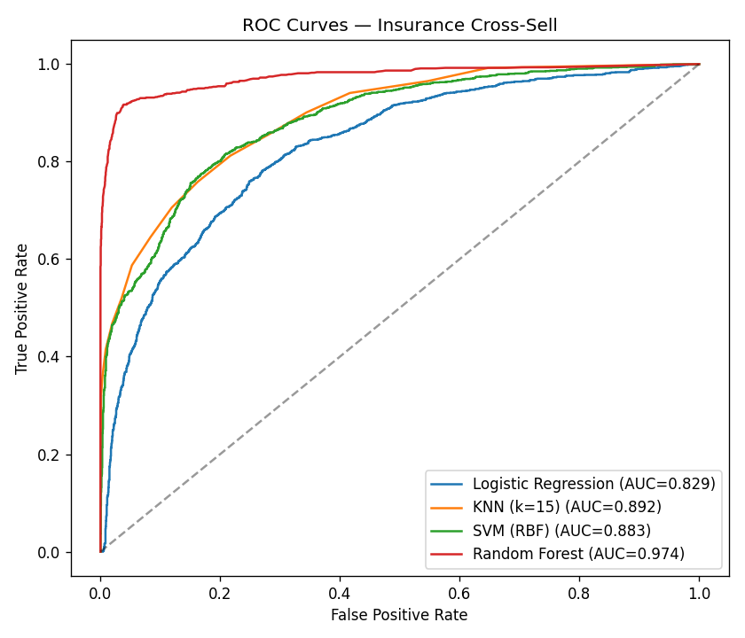
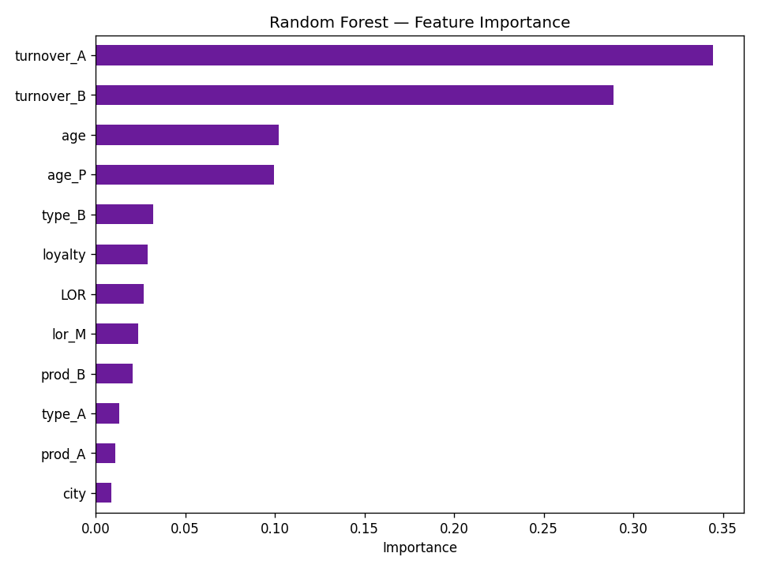

# Insurance Cross-Sell Prediction — KNN & SVM 🛡️

**Predict which existing insurance customers are most likely to buy an additional product, so the sales team can prioritize high-propensity cross-sell leads.**

 
 [](LICENSE)

---

## 💼 Business problem
Cross-selling to existing customers is far cheaper than acquiring new ones. This project builds a classifier that scores each customer's likelihood of responding to a cross-sell offer (`TARGET` = Y/N), turning a 14k-customer book into a **ranked call list** for the sales team.

## 📊 Dataset
`data/M7_Data.csv` (bundled) — **14,016 customers × 15 features**, ~43% positive (cross-sell responders):

| Group | Features |
|---|---|
| Demographics | `age`, `age_P`, `city` |
| Relationship | `loyalty`, `LOR`, `lor_M` (length of relationship), `contract` |
| Product holdings | `prod_A`, `prod_B`, `type_A`, `type_B` |
| Value | `turnover_A`, `turnover_B` |
| Target | **`TARGET`** (Y = responds to cross-sell) |

## 🔬 Methodology
1. **EDA & preparation** — distribution/outlier checks, scaling, train/test split.
2. **Feature selection** — forward **Sequential Feature Selection** (mlxtend) scored on **F1**.
3. **Classification** — **K-Nearest Neighbors** and **Support Vector Machine** (the assignment focus), each tuned with `GridSearchCV`, plus Logistic Regression.
4. **Enhancement** — a reproducible comparison ([`src/model_comparison.py`](src/model_comparison.py)) that adds a **Random Forest** and reports accuracy, precision, recall, F1, and ROC-AUC side by side (SVM scored via decision function).

## 📈 Results

| Model | Accuracy | Precision | Recall | F1 | ROC-AUC |
|---|---|---|---|---|---|
| **Random Forest** | **0.933** | **0.917** | **0.928** | **0.922** | **0.974** |
| KNN (k=15) | 0.806 | 0.817 | 0.706 | 0.757 | 0.892 |
| SVM (RBF) | 0.807 | 0.791 | 0.749 | 0.769 | 0.883 |
| Logistic Regression | 0.751 | 0.705 | 0.725 | 0.715 | 0.829 |

<p align="center">
  
  
</p>

**Takeaway:** KNN and SVM both deliver solid ranking power (ROC-AUC ≈ 0.88–0.89); adding a **Random Forest lifts ROC-AUC to 0.97** and F1 to 0.92, making it the model of choice for lead prioritization. Relationship length and product turnover are the strongest cross-sell signals.

## ▶️ How to run
```bash
pip install -r requirements.txt
jupyter lab notebooks/insurance_cross_sell_knn_svm.ipynb   # EDA + SFS + KNN/SVM (runs end-to-end)
python src/model_comparison.py                              # consolidated comparison + figures
```

## 🗂️ Structure
```
insurance-cross-sell-prediction/
├── data/M7_Data.csv
├── notebooks/insurance_cross_sell_knn_svm.ipynb
├── src/model_comparison.py
├── reports/{model_comparison.md, figures/}
├── requirements.txt
└── README.md
```

## 🛠️ Tech stack
`Python` · `pandas` · `scikit-learn` · `mlxtend` · `Matplotlib` · `Seaborn`

## 🚀 Future improvements
- Calibrated probabilities + a lift/decile table (what % of responders are captured in the top 2 deciles).
- Threshold tuned to the sales team's call capacity; gradient boosting (XGBoost/LightGBM) benchmark.

---
*Academic project (DAV 6150, Module 8), extended with a Random-Forest benchmark and a consolidated model comparison.*
